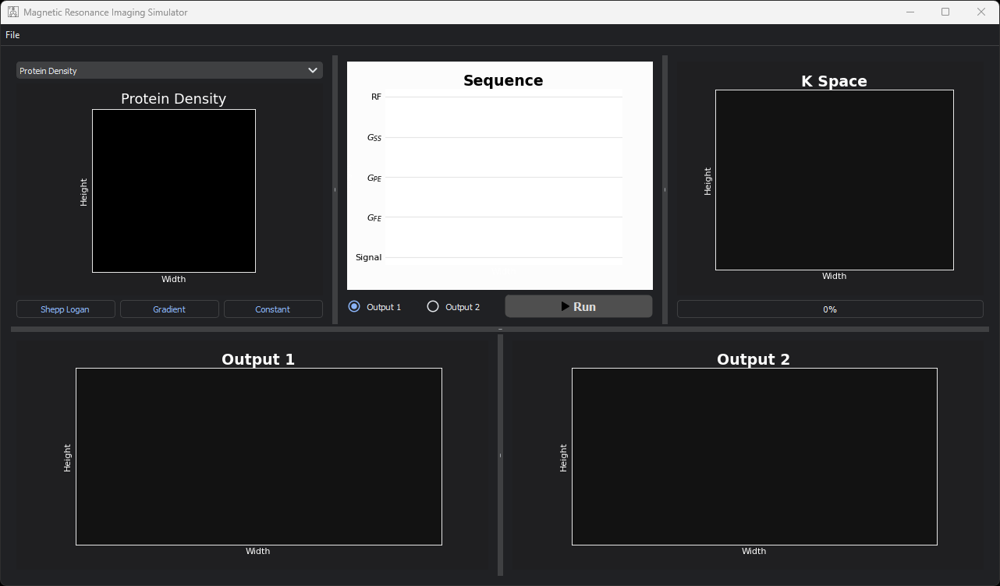
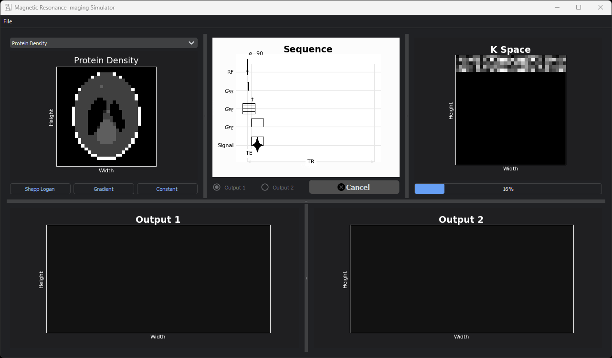
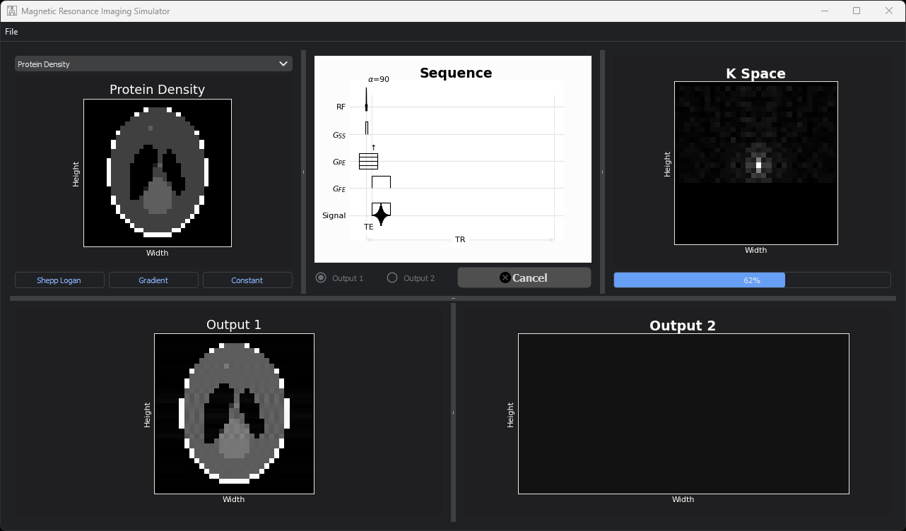
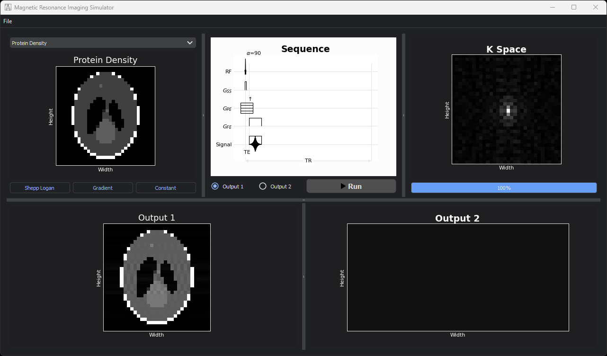
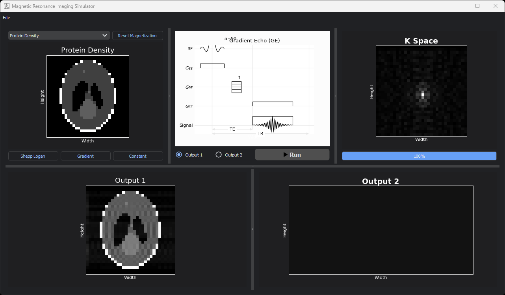

# MRI Simulator


> Magnetic Resonance Imaging Simulator.

---

### Table of Contents

- [Description](#description)
- [How To Use](#how-to-use)
- [Preview](#preview)
- [References](#references)

---

## Description

#### Features

- User can open phantom with random T1, T2, T2*
- User can open a sequence from .json file.
- User can simulate the sequence on the phantom and fill the k space.
- User can compare between outputs that reconstructed from different sequences.

#### Technologies

- Python
- Numpy
- Matplotlib
- mrsd

[Back To The Top](#mri-simulator)

---

## How To Use

#### Installation

```Terminal
$ pip install -r requirements.txt
```

#### Run Locally
Run python3 main.py in the terminal.
```Terminal
$ python3 main.py
```

[Back To The Top](#mri-simulator)

---

## Preview







[Back To The Top](#mri-simulator)

---

## References

- [PyQt5](https://pypi.org/project/PyQt5/)

[Back To The Top](#mri-simulator)

---
